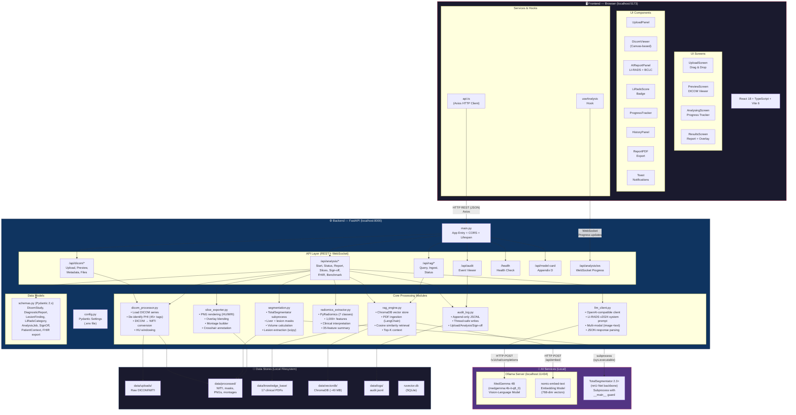
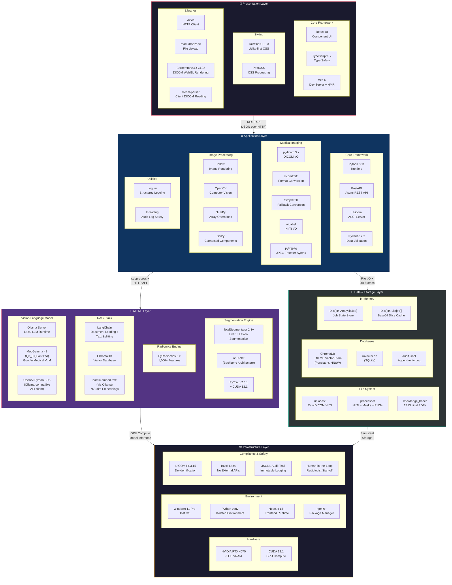

# Liver Cancer AI Diagnostics — Architecture Diagrams

> These diagrams document the complete system architecture, AI model pipeline, and technology framework for the **Liver Cancer AI Diagnostics** thesis project. All diagrams are rendered using Mermaid and are suitable for embedding in thesis chapters.

---

## 1. System Architecture Diagram

This diagram shows the **three-tier architecture**: browser-based frontend, Python FastAPI backend with core processing modules, and local AI inference services. All components run on a single machine — no patient data ever leaves the host.

---

## 2. AI Model Diagram

This diagram traces the **end-to-end AI/ML pipeline** — from raw medical image upload through every processing stage to the final structured diagnostic report with radiologist sign-off.

```mermaid
flowchart TD
    subgraph INPUT["📁 INPUT"]
        direction LR
        DICOM["DICOM Series<br/>(multi-phase CT/MRI)"]
        NIFTI["NIfTI Volume<br/>(.nii.gz)"]
        IMG["JPEG / PNG<br/>(direct image)"]
    end

    subgraph STAGE1["Stage 1 — De-identification"]
        DEID["PHI Removal<br/>(pydicom)<br/>━━━━━━━━━━━━<br/>• 45+ PHI tags stripped<br/>• DICOM PS3.15 BALCP<br/>• Patient ID → ANON_XXXX<br/>• Name → ANONYMIZED"]
    end

    subgraph STAGE2["Stage 2 — Format Conversion"]
        CONV["DICOM → NIfTI<br/>━━━━━━━━━━━━<br/>Primary: dicom2nifti<br/>Fallback: SimpleITK<br/>• Compression + Reorient"]
        PHASE["Phase Detection<br/>━━━━━━━━━━━━<br/>• SeriesDescription parsing<br/>• Keyword matching<br/>• Priority: Arterial → Portal<br/>  → Delayed → Non-contrast"]
        WINDOW["HU Windowing<br/>━━━━━━━━━━━━<br/>CT: C=50, W=400<br/>MRI: Percentile 0.5–99.5<br/>Fallback: Smart percentile"]
    end

    subgraph STAGE3["Stage 3 — Segmentation (GPU)"]
        direction TB
        TS_LIVER["TotalSegmentator<br/>Task: total<br/>ROI: liver<br/>━━━━━━━━━━━━<br/>• nnU-Net backbone<br/>• Fast mode enabled<br/>• Output: liver.nii.gz"]
        TS_TUMOR["TotalSegmentator<br/>Task: liver_lesions<br/>━━━━━━━━━━━━<br/>• Dedicated lesion model<br/>• Output: liver_lesions.nii.gz"]
        EXTRACT["Lesion Extraction<br/>(scipy.ndimage.label)<br/>━━━━━━━━━━━━<br/>• Connected components<br/>• Min 8 voxels<br/>• Max diameter (mm)<br/>• Volume (mL)<br/>• Centroid coordinates"]
        VOL["Volume Calculation<br/>━━━━━━━━━━━━<br/>• Voxel spacing from NIfTI header<br/>• Liver volume (mL)<br/>• Lesion volume (mL)"]
    end

    subgraph STAGE4["Stage 4 — Slice Processing"]
        RENDER["Slice Rendering<br/>━━━━━━━━━━━━<br/>• Best slice selection<br/>  (max tumor area)<br/>• HU / MRI normalization<br/>• 512×512 resize"]
        OVERLAY["Overlay Blending<br/>━━━━━━━━━━━━<br/>• Liver: Orange (α=70)<br/>• Tumor: Crimson (α=130)<br/>• Crosshair + size label"]
        MONTAGE["Montage Builder<br/>━━━━━━━━━━━━<br/>• Up to 4 phases<br/>• 2-column grid layout<br/>• Phase labels (ARTERIAL,<br/>  PORTAL VENOUS, etc.)"]
    end

    subgraph STAGE5["Stage 5 — Radiomics"]
        PYRAD["PyRadiomics 3.x<br/>━━━━━━━━━━━━<br/>Image Types: Original + Wavelet + LoG<br/>σ = [1.0, 2.0, 3.0]<br/><br/>7 Feature Classes:<br/>① Shape (volume, diameter, sphericity)<br/>② First-order (mean, entropy, skewness)<br/>③ GLCM (contrast, correlation, energy)<br/>④ GLRLM (short/long run emphasis)<br/>⑤ GLSZM (zone entropy)<br/>⑥ GLDM (dependence entropy)<br/>⑦ NGTDM (coarseness, contrast)"]
        SUMMARY["35-Feature Clinical Summary<br/>━━━━━━━━━━━━<br/>• Organized by category<br/>• Interpretation hints:<br/>  – Sphericity → shape regularity<br/>  – Skewness → necrosis indicator<br/>  – Entropy → heterogeneity<br/>  – Coarseness → texture grade"]
    end

    subgraph STAGE6["Stage 6 — RAG Retrieval"]
        EMBED["Query Embedding<br/>(nomic-embed-text)<br/>━━━━━━━━━━━━<br/>• 768-dim vector<br/>• via Ollama API"]
        CHROMA["ChromaDB Vector Search<br/>━━━━━━━━━━━━<br/>• Cosine similarity<br/>• Top-5 chunks<br/>• Threshold: >0.25 similarity"]
        GUIDELINES["17 Clinical Guideline PDFs<br/>━━━━━━━━━━━━<br/>• LI-RADS v2018 / v2024<br/>• AASLD 2023<br/>• EASL 2022<br/>• BCLC 2022<br/>• KLCA-NCC 2022<br/>• 9 supporting papers<br/><br/>Ingestion: LangChain<br/>RecursiveTextSplitter<br/>(500 chars, 50 overlap)"]
    end

    subgraph STAGE7["Stage 7 — VLM Analysis"]
        PROMPT["Prompt Assembly<br/>━━━━━━━━━━━━<br/>Inputs combined:<br/>① Montage PNG (base64)<br/>② Segmentation metrics<br/>③ Radiomic summary (35 features)<br/>④ RAG guideline excerpts<br/>⑤ Patient context (optional)<br/>⑥ LI-RADS v2024 system prompt"]
        VLM["MedGemma 4B<br/>(medgemma:4b-it-q8_0)<br/>━━━━━━━━━━━━<br/>• Google medical VLM<br/>• Q8_0 quantization<br/>• Temperature: 0.05<br/>• Max tokens: 2048<br/>• Multi-modal (image + text)<br/>• Local via Ollama"]
        PARSE["JSON Response Parser<br/>━━━━━━━━━━━━<br/>• Strip markdown fences<br/>• Fallback: regex { } extraction<br/>• Map to Pydantic models<br/>• LI-RADS enum validation"]
    end

    subgraph OUTPUT["📊 OUTPUT"]
        direction TB
        REPORT["Structured Diagnostic Report<br/>━━━━━━━━━━━━<br/>• Overall impression<br/>• Per-lesion findings:<br/>  – Location (Couinaud segment)<br/>  – Size (mm)<br/>  – LI-RADS category (LR-1→LR-5/M/TIV)<br/>  – APHE / Washout / Capsule<br/>  – Major + Ancillary features<br/>  – Reasoning<br/>• BCLC stage (0/A/B/C/D)<br/>• Vascular involvement<br/>• Differential diagnosis<br/>• Guideline citations<br/>• Recommendations"]
        SIGNOFF["Radiologist Sign-off<br/>━━━━━━━━━━━━<br/>• Approve / Request Changes<br/>• Radiologist ID + comments<br/>• Timestamp"]
        EXPORT["Export Formats<br/>━━━━━━━━━━━━<br/>• PDF (browser print)<br/>• FHIR R4 DiagnosticReport<br/>• Clipboard (plain text)<br/>• Audit log (JSONL)"]
    end

    %% Flow
    DICOM --> DEID
    NIFTI --> CONV
    IMG -->|"Skip segmentation<br/>(image-only path)"| PROMPT

    DEID --> CONV
    DEID --> PHASE
    CONV --> STAGE3
    PHASE --> MONTAGE

    TS_LIVER --> VOL
    TS_TUMOR --> EXTRACT
    EXTRACT --> VOL

    CONV --> RENDER
    VOL --> RENDER
    RENDER --> OVERLAY
    OVERLAY --> MONTAGE

    CONV --> PYRAD
    TS_TUMOR --> PYRAD
    PYRAD --> SUMMARY

    SUMMARY --> PROMPT
    MONTAGE --> PROMPT
    VOL --> PROMPT

    EMBED --> CHROMA
    CHROMA --> GUIDELINES
    CHROMA --> PROMPT

    PROMPT --> VLM
    VLM --> PARSE
    PARSE --> REPORT
    REPORT --> SIGNOFF
    SIGNOFF --> EXPORT

    %% Styling
    classDef input fill:#2d3436,stroke:#00b894,color:#eee
    classDef process fill:#0f3460,stroke:#e94560,color:#eee
    classDef ai fill:#533483,stroke:#e94560,color:#eee
    classDef output fill:#1a1a2e,stroke:#f39c12,color:#eee

    class INPUT input
    class STAGE1,STAGE2,STAGE4 process
    class STAGE3,STAGE5,STAGE6,STAGE7 ai
    class OUTPUT output
```

---

## 3. Framework & Technology Stack Diagram

This diagram shows the **layered technology framework** — every library, tool, and service organized by architectural tier with their specific roles.

---

## Quick Reference Table

| Diagram | Purpose | Thesis Chapter |
|---|---|---|
| **System Architecture** | Shows how frontend, backend, AI services, and data stores connect | Chapter 3 — System Design |
| **AI Model Pipeline** | Traces data flow from raw image → structured report through all 7 stages | Chapter 4 — Implementation |
| **Framework & Stack** | Catalogs every technology by architectural layer | Chapter 3 — System Design |

---

> **Note:** All three diagrams reflect the codebase as of June 8, 2026. Key source files:
> - Backend entry: [main.py](file:///d:/Steven Project/Liver Cancer/backend/main.py)
> - Core pipeline: [analysis.py](file:///d:/Steven Project/Liver Cancer/backend/api/routes/analysis.py)
> - Segmentation: [segmentation.py](file:///d:/Steven Project/Liver Cancer/backend/core/segmentation.py)
> - VLM client: [llm_client.py](file:///d:/Steven Project/Liver Cancer/backend/core/llm_client.py)
> - RAG engine: [rag_engine.py](file:///d:/Steven Project/Liver Cancer/backend/core/rag_engine.py)
> - Radiomics: [radiomics_extractor.py](file:///d:/Steven Project/Liver Cancer/backend/core/radiomics_extractor.py)
> - Frontend app: [App.tsx](file:///d:/Steven Project/Liver Cancer/frontend/src/App.tsx)
> - Data models: [schemas.py](file:///d:/Steven Project/Liver Cancer/backend/models/schemas.py)
