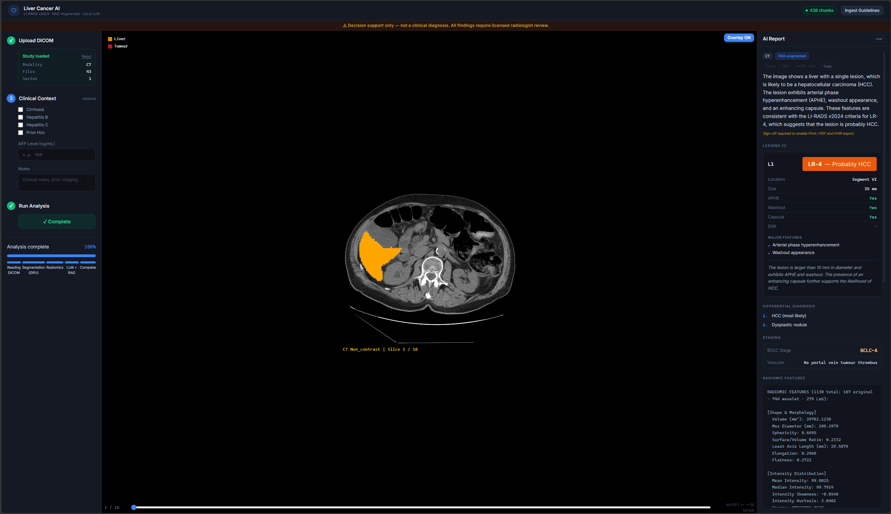
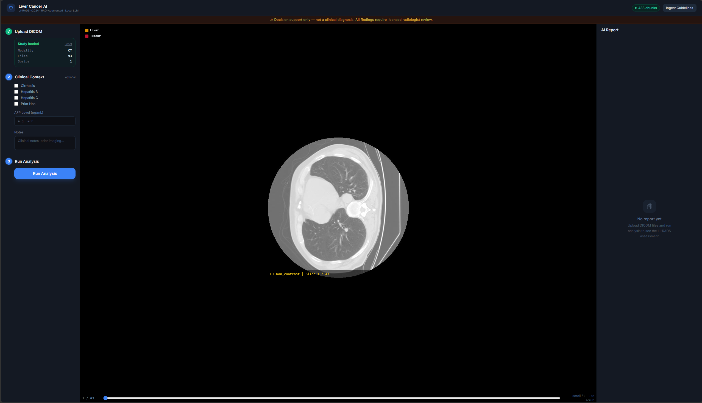
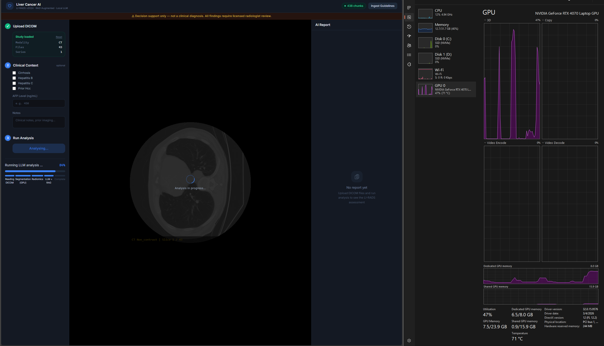
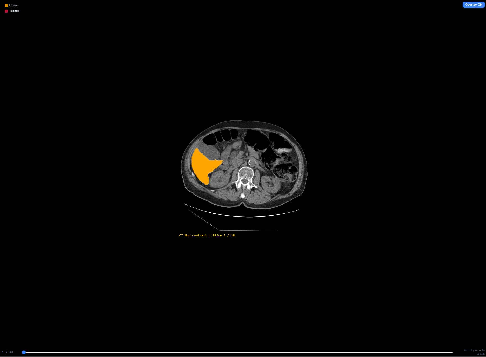
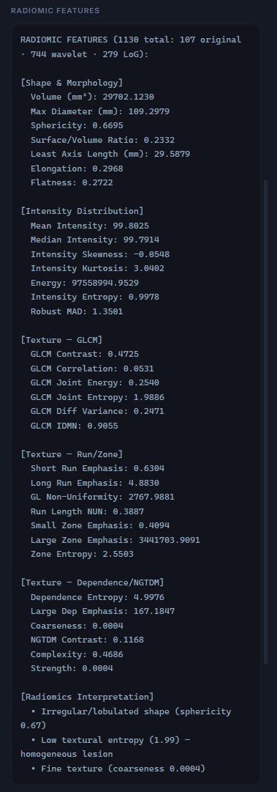

<div align="center">

# 🩺 LuminaDx

### AI-Powered Multi-Cancer Diagnostic Intelligence

**From DICOM to Diagnosis — Locally, Privately, Responsibly.**

[](https://python.org)
[](https://fastapi.tiangolo.com)
[](https://react.dev)
[](https://typescriptlang.org)
[](https://ollama.com)
[](#%EF%B8%8F-license--disclaimer)

---

*A full-stack radiology AI workstation that processes medical imaging (CT/MRI/Dermoscopy),*
*performs automated organ & lesion segmentation, extracts 1,000+ radiomic features,*
*retrieves clinical guidelines via RAG, and generates structured diagnostic reports*
*using vision-language models — all running 100% locally on your GPU.*

<br/>



<br/>

</div>

---

## 🌟 Why LuminaDx?

> **The Problem:** Radiologists face growing caseloads, diagnostic complexity across cancer types, and the need for standardised scoring (LI-RADS, Lung-RADS, BI-RADS, etc.). Cloud-based AI solutions raise privacy concerns with patient data.

> **The Solution:** LuminaDx is an **end-to-end, privacy-first AI diagnostic workstation** that runs entirely on a single machine — no data ever leaves your network. It combines deep learning segmentation, quantitative radiomics, guideline-aware RAG retrieval, and medical vision-language models into one seamless clinical workflow.

<div align="center">

| 🔒 100% Local | 🏥 5 Cancer Types | 🧠 AI Pipeline | 📋 Clinical Standards |
|:---:|:---:|:---:|:---:|
| No cloud APIs | Liver · Lung · Breast · Skin · Colorectal | Segmentation → Radiomics → RAG → VLM | LI-RADS · Lung-RADS · BI-RADS · ABCDE · C-RADS |

</div>

---

## 📸 Screenshots

<div align="center">

| Upload & Preview | AI Analysis in Progress |
|:---:|:---:|
|  |  |

| Segmentation Overlay | Full Report with Radiomics |
|:---:|:---:|
|  |  |

</div>

---

## 🏗️ Architecture

<div align="center">

</div>

### AI Pipeline Flow

```
┌──────────────┐    ┌──────────────┐    ┌──────────────┐    ┌──────────────┐    ┌──────────────┐
│   DICOM      │    │  De-identify │    │  Segment     │    │  Radiomics   │    │  Vision LLM  │
│   Upload     │───▶│  45+ PHI     │───▶│  Organ +     │───▶│  1,000+      │───▶│  MedGemma    │
│              │    │  Tags        │    │  Lesion      │    │  Features    │    │  + RAG       │
└──────────────┘    └──────────────┘    └──────────────┘    └──────────────┘    └──────┬───────┘
                                                                                      │
                    ┌──────────────┐    ┌──────────────┐    ┌──────────────┐           │
                    │  Export      │    │  Sign-off    │    │  Structured  │◀──────────┘
                    │  PDF / FHIR  │◀───│  Radiologist │◀───│  Report      │
                    └──────────────┘    └──────────────┘    └──────────────┘
```

### Technology Stack

<div align="center">

</div>

---

## 🎯 Supported Cancer Types

Each cancer module implements a standardised `DiagnosisModule` interface with its own scoring system, segmentation strategy, system prompt, and report parser.

| Cancer Type | Scoring System | Modality | Key Features |
|:---|:---|:---|:---|
| 🫀 **Liver (HCC)** | LI-RADS v2024 + BCLC | CT / MRI | APHE, washout, capsule assessment; TotalSegmentator liver + lesion masks |
| 🫁 **Lung** | Lung-RADS v2022 | CT | Nodule classification, ground-glass vs solid, calcification patterns |
| 🎀 **Breast** | BI-RADS 5th Ed. | Mammography / MRI | Mass shape, margin analysis, density assessment |
| 🩹 **Skin** | ABCDE + Clark Level | Dermoscopy | Asymmetry, border, colour, diameter, evolution scoring |
| 🔴 **Colorectal** | C-RADS / TNM | CT Colonography | Polyp classification, staging, extramural vascular invasion |

---

## 🧠 AI / ML Components

### Segmentation — TotalSegmentator 2.3+
- **nnU-Net backbone** running on GPU (CUDA 12.1)
- Dual-task pipeline: organ mask → lesion mask
- Connected component analysis for individual lesion extraction
- Volume (mL), max diameter (mm), centroid localisation

### Quantitative Radiomics — PyRadiomics 3.x
- **1,000+ quantitative features** across 7 classes:
  - Shape & Morphology (sphericity, elongation, flatness)
  - First-Order Statistics (mean, skewness, kurtosis, entropy)
  - GLCM (texture contrast, correlation, homogeneity)
  - GLRLM, GLSZM, GLDM, NGTDM
- 35-feature clinical summary auto-generated for LLM consumption

### RAG Pipeline — ChromaDB + LangChain
- Ingests clinical guideline PDFs (LI-RADS v2024, AASLD 2023, EASL, etc.)
- LangChain `RecursiveTextSplitter` (500 chars, 50 overlap)
- `nomic-embed-text` embeddings (768-dim vectors)
- Top-k cosine similarity retrieval injected into the VLM prompt

### Vision-Language Model — MedGemma 4B (Default)
- Google DeepMind's medical VLM via Ollama
- Multi-modal inference: montage PNG + structured text prompt
- Temperature 0.05, max 2,048 tokens
- Swappable models via `.env` (see [Model Reference](#-model-reference))

---

## 🔒 Privacy & Compliance

LuminaDx was designed with **privacy-by-architecture**:

| Feature | Implementation |
|:---|:---|
| **DICOM De-identification** | 45+ PHI tags stripped per DICOM PS3.15 BALCP on upload |
| **100% Local Processing** | No external API calls — all AI runs on localhost |
| **Radiologist-in-the-Loop** | PDF/FHIR export gated behind signed clinical review |
| **Audit Trail** | Append-only JSONL log of every upload, analysis, and sign-off |
| **Role-Based Access** | Admin · Chief Physician · Radiologist with JWT auth |
| **HIPAA Alignment** | PHI de-identified before processing; no data transmitted externally |

---

## 🚀 Quick Start

### Prerequisites

| Requirement | Version | Purpose |
|:---|:---|:---|
| **Python** | 3.11+ | Backend runtime |
| **Node.js** | 18+ | Frontend build |
| **Ollama** | Latest | Local LLM server |
| **CUDA** | 12.1+ | GPU acceleration (optional — CPU fallback available) |
| **GPU** | 8 GB+ VRAM recommended | RTX 4070 / RTX 3080 / etc. |

### 1. Clone & Setup

```bash
git clone https://github.com/Steventanardi/LuminaDX.git
cd LuminaDX
```

### 2. Backend

```bash
cd backend

# Create virtual environment
python -m venv .venv

# Activate (Windows)
.venv\Scripts\activate
# Activate (Linux/macOS)
# source .venv/bin/activate

# Install PyTorch with CUDA first
pip install torch torchvision --index-url https://download.pytorch.org/whl/cu121

# Install all dependencies
pip install -r requirements.txt

# Copy and configure environment
copy .env.example .env
# Edit .env with your preferred model settings
```

### 3. Ollama Models

```bash
# Start Ollama server
ollama serve

# Pull the default medical VLM
ollama pull medgemma:4b-it-q8_0

# Pull the embedding model for RAG
ollama pull nomic-embed-text
```

### 4. Frontend

```bash
cd frontend
npm install
```

### 5. Seed Admin Account

```bash
cd backend
python -m scripts.seed_admin
# Default: admin@luminadx.local / admin123
```

### 6. Launch

**One-click (Windows):**
```bash
Launch.bat
```

**Manual:**
```bash
# Terminal 1 — Backend
cd backend && .venv\Scripts\uvicorn main:app --reload --port 8000

# Terminal 2 — Frontend
cd frontend && npm run dev
```

Open **http://localhost:5173** → Login → Upload DICOM → Run Analysis.

---

## 📁 Project Structure

```
LuminaDx/
├── backend/
│   ├── api/
│   │   ├── routes/
│   │   │   ├── analysis.py      # Start, status, report, sign-off, FHIR export
│   │   │   ├── auth.py          # Login, register, JWT, RBAC
│   │   │   ├── dicom.py         # Upload, preview, de-identification
│   │   │   ├── rag.py           # Ingest guidelines, query, status
│   │   │   └── audit.py         # Append-only event log viewer
│   │   └── deps.py              # Auth dependencies & middleware
│   ├── core/
│   │   ├── modules/
│   │   │   ├── base.py          # DiagnosisModule ABC (protocol)
│   │   │   ├── liver.py         # LI-RADS v2024 + BCLC
│   │   │   ├── lung.py          # Lung-RADS v2022
│   │   │   ├── breast.py        # BI-RADS 5th Ed.
│   │   │   ├── skin.py          # ABCDE + Clark Level
│   │   │   ├── colorectal.py    # C-RADS / TNM
│   │   │   └── registry.py      # Module registry & factory
│   │   ├── dicom_processor.py   # Load, de-ID, convert DICOM→NIfTI
│   │   ├── segmentation.py      # TotalSegmentator wrapper
│   │   ├── radiomics_extractor.py # PyRadiomics feature extraction
│   │   ├── rag_engine.py        # ChromaDB + LangChain RAG
│   │   ├── llm_client.py        # Ollama VLM inference
│   │   ├── slice_exporter.py    # PNG montage + overlay generation
│   │   └── store.py             # In-memory job store
│   ├── data/
│   │   └── knowledge_base/      # Clinical guideline PDFs (user-supplied)
│   ├── config.py                # Pydantic settings
│   ├── main.py                  # FastAPI app entrypoint
│   └── requirements.txt
├── frontend/
│   ├── src/
│   │   ├── components/
│   │   │   ├── AIReportPanel.tsx     # Structured report viewer
│   │   │   ├── AdminDashboard.tsx    # User management (RBAC)
│   │   │   ├── DicomViewer.tsx       # Slice viewer with overlay toggle
│   │   │   ├── LoginScreen.tsx       # Auth gateway
│   │   │   ├── ReportPDF.tsx         # PDF export (react-pdf)
│   │   │   └── ...
│   │   ├── context/AuthContext.tsx   # JWT session management
│   │   ├── hooks/useAnalysis.ts     # Analysis polling hook
│   │   ├── services/api.ts         # Axios HTTP client
│   │   ├── i18n.tsx                 # EN / 繁中 bilingual support
│   │   └── types/index.ts          # Shared TypeScript types
│   ├── package.json
│   └── vite.config.ts
├── scripts/
│   ├── seed_admin.py               # Create initial admin user
│   ├── batch_validate.py           # Batch validation runner
│   ├── download_dicom_datasets.py  # TCIA dataset downloader
│   ├── ingest_guidelines.py        # CLI RAG ingestion
│   └── setup.ps1                   # Windows setup automation
├── docs/
│   └── thesis/                     # Academic thesis chapters
├── Launch.bat                      # One-click launcher (Windows)
└── README.md
```

---

## 🔧 Model Reference

LuminaDx supports swappable vision-language models via Ollama. Set `LLM_MODEL` in `backend/.env`:

| Model | Env Value | VRAM | Best For |
|:---|:---|:---:|:---|
| **MedGemma 4B** *(default)* | `medgemma:4b-it-q8_0` | ~6 GB | Medical imaging, fast inference |
| MedGemma 4B (lighter) | `medgemma:4b-it-q4_K_M` | ~3.5 GB | Maximum headroom on 8 GB GPUs |
| Qwen2.5-VL 3B | `qwen2.5vl:3b` | ~3.5 GB | Structured JSON, 8 GB safe |
| MiniCPM-V 8B | `minicpm-v:8b` | ~5.5 GB | Dermoscopy, mammography |
| LLaVA 7B | `llava:7b` | ~4.7 GB | Widely tested in medical research |
| Qwen2.5-VL 7B | `qwen2.5vl:7b` | ~7 GB | Charts/tables (tight on 8 GB) |
| LLaMA 3.2 Vision 11B | `llama3.2-vision:11b` | ~9 GB | Strong general vision (12 GB+ GPU) |
| MedGemma 27B | `medgemma:27b-it-q4_K_M` | ~16 GB | Best reasoning (16 GB+ GPU) |

> 💡 **8 GB GPU users:** Use `medgemma:4b-it-q8_0` or `qwen2.5vl:3b`. Segmentation runs first and releases VRAM before the LLM loads.

---

## 🔌 API Reference

| Endpoint | Method | Description |
|:---|:---:|:---|
| `/api/auth/login` | POST | JWT login |
| `/api/auth/me` | GET | Current user info |
| `/api/dicom/upload` | POST | Upload DICOM files (auto de-ID) |
| `/api/dicom/preview/{id}` | GET | Get preview slices |
| `/api/analysis/start/{id}` | POST | Start AI analysis pipeline |
| `/api/analysis/status/{id}` | GET | Poll analysis progress |
| `/api/analysis/report/{id}` | GET | Get structured diagnostic report |
| `/api/analysis/signoff/{id}` | POST | Radiologist sign-off |
| `/api/analysis/fhir/{id}` | GET | FHIR R4 DiagnosticReport export |
| `/api/rag/ingest` | POST | Ingest guideline PDFs |
| `/api/rag/status` | GET | RAG knowledge base status |
| `/health` | GET | Server health check |

> Full interactive API docs available at **http://localhost:8000/docs** when the backend is running.

---

## 🌐 Internationalisation

LuminaDx ships with bilingual support:

| Language | Code | Coverage |
|:---|:---:|:---|
| 🇬🇧 English | `en` | Full |
| 🇹🇼 繁體中文 (Traditional Chinese) | `zh-TW` | Full |

Toggle with the **EN / 繁中** button in the header.

---

## 🧪 Validation & Testing

```bash
# Generate synthetic DICOM test data
python scripts/generate_test_dicom.py

# Run batch validation across datasets
python scripts/batch_validate.py

# Verify DICOM de-identification compliance
python scripts/verify_deidentification.py

# Summarise validation results
python scripts/summarize_results.py
```

---

## 📚 Academic Context

This project is developed as part of an academic thesis:

> **"AI-Powered Multi-Cancer Diagnosis from Medical Imaging Using Vision-Language Models"**
>
> The system demonstrates how locally-deployed, open-source AI models can provide
> structured, guideline-compliant diagnostic decision support while maintaining
> full patient data privacy — a critical requirement for clinical AI adoption.

### Key Research Contributions

1. **Multi-cancer modular architecture** — Pluggable `DiagnosisModule` pattern supporting 5+ cancer types with standardised interfaces
2. **RAG-augmented medical VLM** — Retrieval-Augmented Generation injects real clinical guidelines into LLM prompts, grounding outputs in evidence
3. **Quantitative radiomics integration** — 1,000+ PyRadiomics features complement visual analysis with objective measurements
4. **Privacy-by-architecture** — End-to-end local processing with DICOM de-identification, audit logging, and radiologist sign-off gates

---

## 🤝 Contributing

This is a research project. Contributions, suggestions, and feedback are welcome:

1. Fork the repository
2. Create a feature branch (`git checkout -b feature/improvement`)
3. Commit your changes (`git commit -m 'Add: description'`)
4. Push to the branch (`git push origin feature/improvement`)
5. Open a Pull Request

---

## ⚖️ License & Disclaimer

> [!CAUTION]
> **LuminaDx is a research prototype — NOT a certified medical device.**
>
> - Not approved for clinical patient management (no CE mark, no FDA 510(k))
> - Must NOT be used as the sole basis for clinical decisions
> - All findings require review by a licensed radiologist
> - AI-generated reports are decision support only

This project is intended for **academic research and educational purposes only**.

---

<div align="center">

**Built with 🩺 for the future of radiology AI**

*LuminaDx — Because every diagnosis deserves intelligence, privacy, and precision.*

<br/>

<sub>© 2026 Steven Tanardi · Research Project</sub>

</div>
