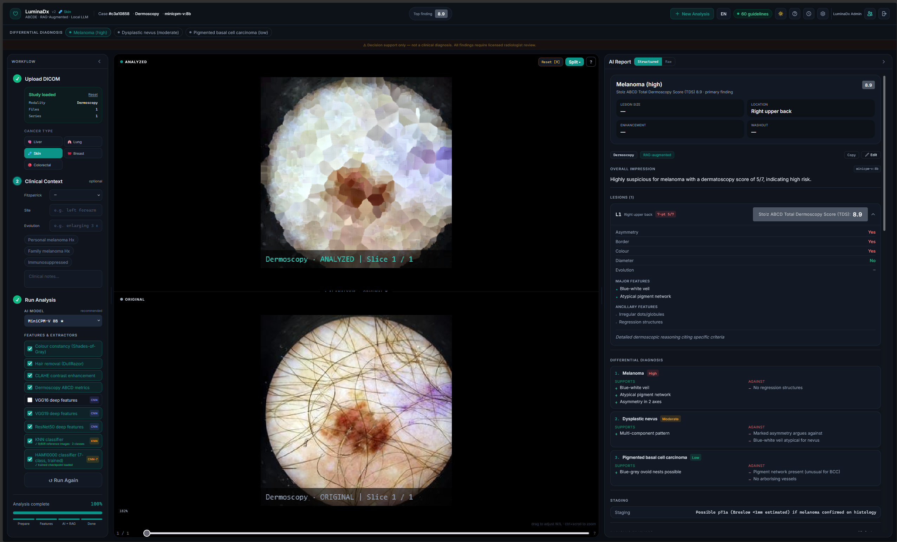
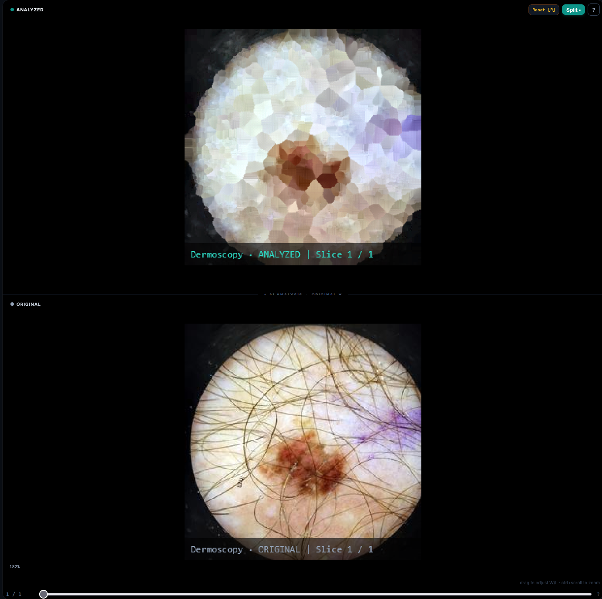
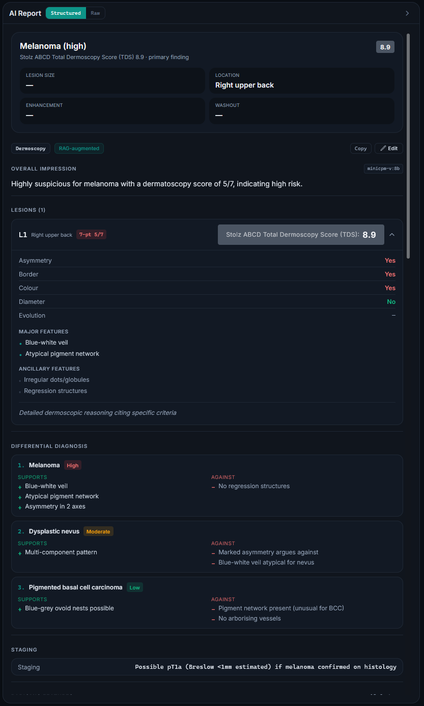
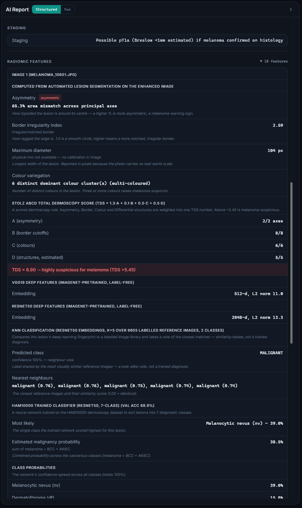
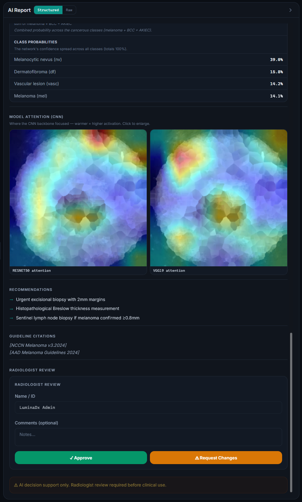
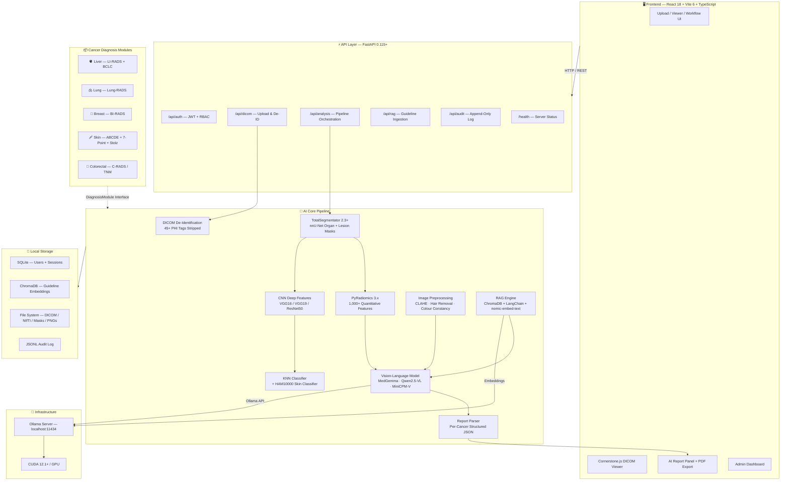
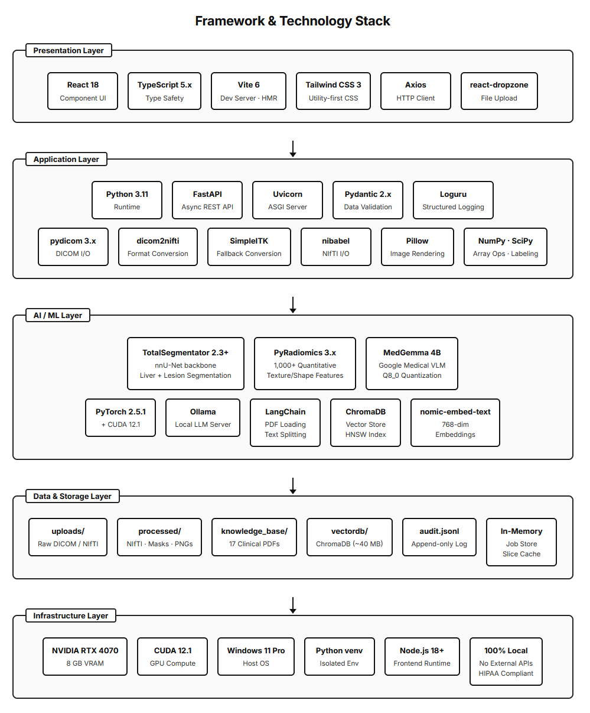
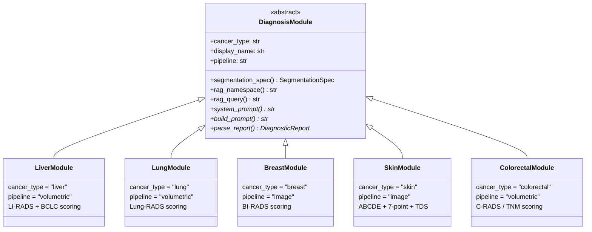
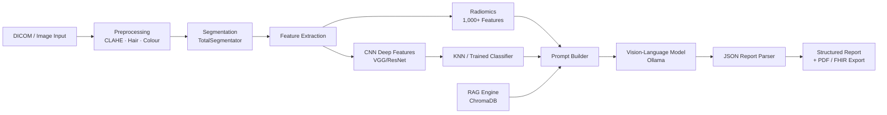

<div align="center">

# 🩺 LuminaDx

### AI-Powered Multi-Cancer Diagnostic Intelligence

**From DICOM to Diagnosis — Locally, Privately, Responsibly.**

[](https://python.org)
[](https://fastapi.tiangolo.com)
[](https://react.dev)
[](https://typescriptlang.org)
[](https://vite.dev)
[](https://ollama.com)
[](https://tailwindcss.com)
[](#%EF%B8%8F-license--disclaimer)

---

*A full-stack radiology AI workstation that processes medical imaging (CT/MRI/Dermoscopy/Mammography),*
*performs automated organ & lesion segmentation, extracts 1,000+ radiomic features,*
*runs CNN deep-feature analysis with KNN classification,*
*retrieves clinical guidelines via RAG, and generates structured diagnostic reports*
*using vision-language models — all running 100% locally on your GPU.*

<br/>



<br/>

</div>

---

## 🌟 Why LuminaDx?

> **The Problem:** Radiologists face growing caseloads, diagnostic complexity across cancer types, and the need for standardised scoring (LI-RADS, Lung-RADS, BI-RADS, etc.). Cloud-based AI solutions raise privacy concerns with patient data.

> **The Solution:** LuminaDx is an **end-to-end, privacy-first AI diagnostic workstation** that runs entirely on a single machine — no data ever leaves your network. It combines deep learning segmentation, quantitative radiomics, CNN deep-feature analysis, guideline-aware RAG retrieval, and medical vision-language models into one seamless clinical workflow.

<div align="center">

| 🔒 100% Local | 🏥 5 Cancer Types | 🧠 AI Pipeline | 📋 Clinical Standards |
|:---:|:---:|:---:|:---:|
| No cloud APIs | Liver · Lung · Breast · Skin · Colorectal | Segmentation → Radiomics → CNN → RAG → VLM | LI-RADS · Lung-RADS · BI-RADS · ABCDE · C-RADS |

</div>

---

## 📸 Screenshots

<div align="center">

| Analysed Lesion View | Structured AI Report (Part 1) |
|:---:|:---:|
|  |  |

| Quantitative Radiomics | Model Attention & Recommendations |
|:---:|:---:|
|  |  |

</div>

---

## 🏗️ System Architecture

<div align="center">

</div>



### AI Pipeline Flow

The diagnostic pipeline follows a **6-stage sequential architecture** where each stage enriches the context available to the next:

```text
┌──────────────┐    ┌──────────────┐    ┌──────────────┐    ┌──────────────┐    ┌──────────────┐    ┌──────────────┐
│  1. Upload   │    │  2. Pre-proc │    │  3. Segment  │    │  4. Extract  │    │  5. Retrieve │    │  6. Generate │
│  DICOM/Image │───▶│  De-ID +     │───▶│  Organ +     │───▶│  Radiomics   │───▶│  RAG Context │───▶│  VLM Report  │
│              │    │  Enhancement │    │  Lesion      │    │  + CNN + KNN │    │  Guidelines  │    │  + Parsing   │
└──────────────┘    └──────────────┘    └──────────────┘    └──────────────┘    └──────────────┘    └──────┬───────┘
                                                                                                          │
                    ┌──────────────┐    ┌──────────────┐    ┌──────────────┐                               │
                    │  Export      │    │  Sign-off    │    │  Structured  │◀──────────────────────────────┘
                    │  PDF / FHIR  │◀───│  Radiologist │◀───│  Report      │
                    └──────────────┘    └──────────────┘    └──────────────┘
```

**Stage details:**

| Stage | Component | What It Does |
|:---:|:---|:---|
| 1 | **Upload** | Receives CT/MRI/Dermoscopy/Mammography files via `/api/dicom/upload` |
| 2 | **Pre-processing** | Strips 45+ DICOM PHI tags per PS3.15 BALCP; applies CLAHE, DullRazor, and Colour Constancy |
| 3 | **Segmentation** | TotalSegmentator dual-task (organ → lesion) with connected component analysis |
| 4 | **Feature Extraction** | PyRadiomics (1,000+ features) + CNN deep features (VGG16/19/ResNet50) + KNN/trained classifiers |
| 5 | **RAG Retrieval** | ChromaDB cosine similarity search over ingested clinical guidelines |
| 6 | **VLM Report** | Montage PNG + structured text prompt → vision-language model → JSON report parsing |

### Technology Stack

<div align="center">

</div>

<table>
<tr><th>Layer</th><th>Technology</th><th>Version</th><th>Purpose</th></tr>
<tr><td rowspan="5"><strong>Frontend</strong></td>
    <td>React</td><td>18.3</td><td>Component-based UI framework</td></tr>
<tr><td>TypeScript</td><td>5.7</td><td>Type-safe development</td></tr>
<tr><td>Vite</td><td>6.0</td><td>Build tool & dev server</td></tr>
<tr><td>Tailwind CSS</td><td>3.4</td><td>Utility-first styling</td></tr>
<tr><td>Cornerstone.js</td><td>4.22</td><td>Medical DICOM image viewer</td></tr>
<tr><td rowspan="5"><strong>Backend</strong></td>
    <td>FastAPI</td><td>0.115+</td><td>Async REST API framework</td></tr>
<tr><td>Uvicorn</td><td>0.32+</td><td>ASGI server</td></tr>
<tr><td>SQLAlchemy</td><td>2.0+</td><td>ORM & database management</td></tr>
<tr><td>Pydantic</td><td>2.9+</td><td>Data validation & settings</td></tr>
<tr><td>Loguru</td><td>0.7+</td><td>Structured logging</td></tr>
<tr><td rowspan="5"><strong>AI / ML</strong></td>
    <td>TotalSegmentator</td><td>2.3+</td><td>nnU-Net organ & lesion segmentation</td></tr>
<tr><td>PyRadiomics</td><td>3.x</td><td>Quantitative radiomic feature extraction</td></tr>
<tr><td>PyTorch</td><td>2.x (CUDA 12.1)</td><td>Deep learning runtime (CNN features, classifiers)</td></tr>
<tr><td>LangChain + ChromaDB</td><td>0.3+ / 0.5+</td><td>RAG pipeline & vector store</td></tr>
<tr><td>Ollama</td><td>Latest</td><td>Local LLM server (MedGemma, Qwen2.5-VL, MiniCPM-V)</td></tr>
<tr><td rowspan="3"><strong>Medical Imaging</strong></td>
    <td>pydicom</td><td>3.0+</td><td>DICOM file parsing & de-identification</td></tr>
<tr><td>SimpleITK</td><td>2.4+</td><td>Medical image processing</td></tr>
<tr><td>nibabel</td><td>5.3+</td><td>NIfTI file handling</td></tr>
<tr><td rowspan="3"><strong>Auth & Security</strong></td>
    <td>PyJWT</td><td>2.10+</td><td>JSON Web Token authentication</td></tr>
<tr><td>bcrypt</td><td>4.0+</td><td>Password hashing</td></tr>
<tr><td>SlowAPI</td><td>0.1.9+</td><td>Rate limiting</td></tr>
</table>

---

## 🚀 Installation & Quick Start

LuminaDx is designed to run locally to ensure patient data privacy. Follow these steps to set up the environment.

### Prerequisites

| Requirement | Version / Detail | Purpose |
|:---|:---|:---|
| **OS** | Windows 10/11, Linux, macOS | Primary development target is Windows |
| **Python** | 3.11+ | Backend runtime |
| **Node.js** | 18+ | Frontend build and development server |
| **Ollama** | Latest | Local LLM server for Vision-Language Models |
| **CUDA** | 12.1+ | GPU acceleration (highly recommended) |
| **GPU** | 8 GB+ VRAM | Required for local AI models (RTX 3080/4070 or better) |

### 1. Clone the Repository

```bash
git clone https://github.com/Steventanardi/LuminaDX.git
cd LuminaDX
```

### 2. Automated Setup (Windows)

For Windows users, an automated setup script handles the Python virtual environment, dependencies, and Ollama model pulls.

1. Open PowerShell. If execution policies restrict running scripts:
   ```powershell
   Set-ExecutionPolicy -Scope Process -ExecutionPolicy Bypass
   ```
2. Run the setup script from the project root:
   ```powershell
   .\scripts\shared\setup.ps1
   ```

> **Note:** The script installs PyTorch with CUDA 12.1 support and pulls standard Ollama models.

### 3. Manual Setup (All Platforms)

#### Backend Setup

```bash
cd backend

# Create virtual environment
python -m venv .venv

# Activate (Windows)
.venv\Scripts\activate
# Activate (Linux/macOS)
# source .venv/bin/activate

# Install PyTorch with CUDA 12.1 (adjust for your CUDA version)
pip install torch torchvision --index-url https://download.pytorch.org/whl/cu121

# Install backend dependencies
pip install -r requirements.txt

# Configure environment variables
cp .env.example .env
```

> **Important:** Edit `backend/.env` and set `AUTH_SECRET_KEY` — the app **refuses to start** with the default value.
> Generate one with:
> ```bash
> python -c "import secrets; print(secrets.token_urlsafe(48))"
> ```

#### Frontend Setup

Open a new terminal:

```bash
cd frontend
npm install
```

#### Ollama Models

Install [Ollama](https://ollama.com/) and start the server, then pull the required models:

```bash
# Start Ollama server (usually runs automatically after installation)
ollama serve

# Pull the default medical VLM
ollama pull medgemma:4b-it-q8_0

# Pull the embedding model for RAG
ollama pull nomic-embed-text
```

Depending on the cancer types you plan to analyse, also pull the recommended models:
- `ollama pull qwen2.5vl:7b` — Default for Lung and Colorectal
- `ollama pull minicpm-v:8b` — Default for Skin and Breast

### 4. Database & Admin Setup

Before launching the app, seed the database with an initial admin account. Ensure your backend virtual environment is activated.

```bash
cd backend
python -m scripts.shared.seed_admin
```

*By default, this creates an account with:*
- **Email:** `admin@luminadx.local`
- **Password:** `admin123` *(Override by setting `ADMIN_PASSWORD` env var before running)*

### 5. Launch the Application

**One-click (Windows):**
Double-click `Launch.bat` in the project root. It starts both backend and frontend servers in separate windows and opens the browser automatically.

**Manual (Two terminals):**

```bash
# Terminal 1 — Backend
cd backend
# Activate virtual environment
uvicorn main:app --reload --port 8000

# Terminal 2 — Frontend
cd frontend
npm run dev
```

**PowerShell scripts:**
```powershell
.\start_backend.ps1    # http://localhost:8000
.\start_frontend.ps1   # http://localhost:5173
```

Open **http://localhost:5173** → Log in with admin credentials → Upload a DICOM file → Run Analysis.

### 6. Optional: Ingest Clinical Guidelines for RAG

To enable Retrieval-Augmented Generation with clinical guidelines:
1. Place guideline PDFs in `backend/data/knowledge_base/` (e.g., LI-RADS 2024, AASLD HCC Guidance).
2. Run the ingestion script:
   ```bash
   cd scripts/shared
   # Activate your backend virtual environment first
   python ingest_guidelines.py
   ```

### 7. Optional: Download Evaluation Datasets

LuminaDx supports several public imaging datasets (ISIC, TCIA, etc.) for testing and evaluation:

```bash
# Download Kaggle datasets (ISIC, RSNA, HAM10000)
python scripts/download/download_kaggle.py all

# Get instructions/manifests for TCIA datasets (HCC-TACE-Seg, Lung-PET-CT-Dx)
python scripts/download/download_tcia.py all

# Get instructions for Zenodo/GitHub datasets
python scripts/download/download_zenodo.py all
```

### 8. Health Check (Recommended)

Run the comprehensive health check to verify everything is wired up correctly:

```powershell
# Check only — reports problems, changes nothing
.\scripts\health\health_check.ps1

# Auto-fix — repairs what it safely can (creates venv, installs deps, generates secrets, pulls models)
.\scripts\health\health_check.ps1 -Fix
```

The health check validates: tooling, backend venv/deps, `.env` configuration, frontend deps, backend import & tests, model/feature catalog integrity, frontend typecheck, and Ollama connectivity. See [`scripts/health/HOW_TO.md`](scripts/health/HOW_TO.md) for details.

---

## 🎯 Supported Cancer Types

Each cancer module implements a standardised `DiagnosisModule` interface (defined in `backend/core/modules/base.py`) with its own scoring system, segmentation strategy, system prompt, and JSON report parser.

| Cancer Type | Scoring System | Modality | Key Features |
|:---|:---|:---|:---|
| 🫀 **Liver (HCC)** | LI-RADS v2024 + BCLC | CT / MRI | APHE, washout, capsule assessment; TotalSegmentator liver + lesion masks |
| 🫁 **Lung** | Lung-RADS v2022 | CT | Nodule classification, ground-glass vs solid, calcification patterns |
| 🎀 **Breast** | BI-RADS 5th Ed. | Mammography / MRI | Mass shape, margin analysis, density assessment (ACR a–d) |
| 🩹 **Skin** | ABCDE + 7-point + Stolz TDS | Dermoscopy | Asymmetry/border/colour/diameter + evolution; hardened lesion segmentation (vignette/ruler/low-contrast/multi-lesion aware); trained HAM10000 ResNet50 (7-class, TTA) + KNN; multi-image |
| 🔴 **Colorectal** | C-RADS / TNM | CT Colonography | Polyp classification, staging, extramural vascular invasion |



---

## 🧠 AI / ML Components

### Segmentation — TotalSegmentator 2.3+
- **nnU-Net backbone** running on GPU (CUDA 12.1)
- Dual-task pipeline: organ mask → lesion mask
- Connected component analysis for individual lesion extraction
- Volume (mL), max diameter (mm), centroid localisation

### Quantitative Radiomics — PyRadiomics 3.x
- **1,000+ quantitative features** across 7 classes:
  - Shape & Morphology (sphericity, elongation, flatness)
  - First-Order Statistics (mean, skewness, kurtosis, entropy)
  - GLCM (texture contrast, correlation, homogeneity)
  - GLRLM, GLSZM, GLDM, NGTDM
- 35-feature clinical summary auto-generated for LLM consumption
- Extended feature mode (wavelet/LoG) configurable via `RADIOMICS_EXTENDED` env var

### CNN Deep Features & Classification
- **ImageNet-pretrained backbones**: VGG16, VGG19, ResNet50
- Deep feature extraction with Grad-CAM attention heatmap overlay
- **KNN Classifier**: Reference-image-based classification using CNN embeddings
- **HAM10000 Skin Classifier**: Trained 7-class ResNet50 with test-time augmentation (TTA)
- All CNN/classifier features are selectable per-cancer via the UI feature picker

### Image Preprocessing Pipeline
- **Colour Constancy** — Shades-of-Gray white-balance normalisation
- **Hair Removal** — DullRazor algorithm for dermoscopy
- **CLAHE** — Contrast-Limited Adaptive Histogram Equalisation
- Configurable per-cancer via the feature catalog

### RAG Pipeline — ChromaDB + LangChain
- Ingests clinical guideline PDFs (LI-RADS v2024, AASLD 2023, EASL, etc.)
- LangChain `RecursiveTextSplitter` (500 chars, 50 overlap)
- `nomic-embed-text` embeddings (768-dim vectors) with batched ingestion (64 chunks/batch to prevent OOM)
- Top-k cosine similarity retrieval injected into the VLM prompt

### Vision-Language Model
- Multi-modal inference: montage PNG + structured text prompt
- Default models are configured per cancer type (see Model Reference)
- Swappable models via `.env` or in-app UI model picker dropdown
- Robust JSON parsing with multi-layer repair: markdown fence stripping, comment removal, trailing comma cleanup, invalid escape correction



---

## 🔒 Privacy & Compliance

LuminaDx was designed with **privacy-by-architecture**:

| Feature | Implementation |
|:---|:---|
| **DICOM De-identification** | 45+ PHI tags stripped per DICOM PS3.15 BALCP on upload |
| **100% Local Processing** | No external API calls — all AI runs on localhost |
| **Radiologist-in-the-Loop** | PDF/FHIR export gated behind signed clinical review |
| **Audit Trail** | Append-only JSONL log of every upload, analysis, and sign-off |
| **Role-Based Access** | Admin · Chief Physician · Radiologist with JWT auth |
| **HIPAA Alignment** | PHI de-identified before processing; no data transmitted externally |
| **Rate Limiting** | SlowAPI rate limiter on authentication endpoints |
| **Secure Secrets** | App refuses to start with default `AUTH_SECRET_KEY` |

---

## 📁 Project Structure

```text
LuminaDx/
├── backend/
│   ├── api/
│   │   ├── routes/               # REST endpoints
│   │   │   ├── analysis.py       #   Pipeline orchestration & model/feature catalogs
│   │   │   ├── auth.py           #   JWT login, registration, role management
│   │   │   ├── dicom.py          #   DICOM upload, de-identification, preview
│   │   │   ├── rag.py            #   Guideline ingestion & RAG status
│   │   │   └── audit.py          #   Append-only audit log retrieval
│   │   └── deps.py               # Auth dependencies & JWT middleware
│   ├── core/
│   │   ├── modules/              # Cancer-specific diagnosis logic
│   │   │   ├── base.py           #   DiagnosisModule ABC + JSON repair utilities
│   │   │   ├── liver.py          #   LI-RADS + BCLC scoring
│   │   │   ├── lung.py           #   Lung-RADS scoring
│   │   │   ├── breast.py         #   BI-RADS scoring
│   │   │   ├── skin.py           #   ABCDE + 7-point + Stolz TDS
│   │   │   ├── colorectal.py     #   C-RADS / TNM scoring
│   │   │   └── registry.py       #   Module registration & lookup
│   │   ├── dicom_processor.py    # DICOM parsing & PHI de-identification
│   │   ├── segmentation.py       # TotalSegmentator wrapper
│   │   ├── radiomics_extractor.py# PyRadiomics feature extraction
│   │   ├── cnn_features.py       # VGG/ResNet deep features + Grad-CAM
│   │   ├── knn_classifier.py     # KNN reference-based classifier
│   │   ├── skin_classifier.py    # HAM10000 trained 7-class classifier
│   │   ├── image_preprocess.py   # CLAHE, hair removal, colour constancy
│   │   ├── feature_catalog.py    # Per-cancer feature/extractor registry
│   │   ├── model_catalog.py      # Per-cancer LLM model registry
│   │   ├── rag_engine.py         # ChromaDB + LangChain RAG pipeline
│   │   ├── llm_client.py         # Ollama VLM inference client
│   │   ├── slice_exporter.py     # NIfTI → PNG slice + montage generation
│   │   ├── store.py              # In-memory analysis state store
│   │   ├── database.py           # SQLAlchemy setup & user DB
│   │   ├── audit_log.py          # JSONL audit logger
│   │   ├── auth_utils.py         # Password hashing & JWT helpers
│   │   └── rate_limit.py         # SlowAPI rate limiter
│   ├── models/
│   │   └── schemas.py            # Pydantic schemas (DiagnosticReport, etc.)
│   ├── data/                     # Local data (uploads, processed, DBs, logs, weights)
│   ├── tests/                    # pytest test suite (9 test files)
│   ├── scripts/                  # Backend-specific scripts
│   │   ├── shared/               #   KNN eval, guideline ingestion
│   │   └── skin/                 #   Skin classification evaluation
│   ├── docs/                     # Model card & documentation
│   ├── config.py                 # Pydantic Settings (env-driven configuration)
│   ├── main.py                   # FastAPI app entrypoint (v0.2.0)
│   ├── requirements.txt          # Python dependencies
│   └── .env.example              # Environment variable template
├── frontend/
│   ├── src/
│   │   ├── components/           # React components (16 files)
│   │   │   ├── UploadScreen.tsx   #   DICOM file upload with drag-and-drop
│   │   │   ├── PreviewScreen.tsx  #   Slice preview before analysis
│   │   │   ├── WorkflowPanel.tsx  #   Model picker + feature selector + run analysis
│   │   │   ├── DicomViewer.tsx    #   Cornerstone.js DICOM viewer
│   │   │   ├── AnalysingScreen.tsx#   Progress tracking during analysis
│   │   │   ├── ResultsScreen.tsx  #   Results overview
│   │   │   ├── AIReportPanel.tsx  #   Structured diagnostic report display
│   │   │   ├── ReportSections.tsx #   Per-cancer report section rendering
│   │   │   ├── ReportPDF.tsx      #   @react-pdf/renderer PDF generation
│   │   │   ├── AdminDashboard.tsx #   User management & system admin
│   │   │   ├── LoginScreen.tsx    #   Authentication UI
│   │   │   ├── HistoryPanel.tsx   #   Analysis history
│   │   │   ├── ProgressTracker.tsx#   Step-by-step progress display
│   │   │   ├── LiRadsScore.tsx    #   LI-RADS visual score badge
│   │   │   └── Toast.tsx          #   Notification toasts
│   │   ├── context/
│   │   │   └── AuthContext.tsx    # Auth state management
│   │   ├── hooks/
│   │   │   └── useAnalysis.ts    # Analysis polling hook
│   │   ├── services/
│   │   │   └── api.ts            # Axios API client
│   │   ├── types/
│   │   │   └── index.ts          # TypeScript type definitions
│   │   ├── i18n.tsx              # EN / zh-TW translation strings
│   │   ├── App.tsx               # Main application component
│   │   └── main.tsx              # React entrypoint
│   ├── tailwind.config.js        # Tailwind CSS configuration
│   ├── vite.config.ts            # Vite build configuration
│   └── package.json              # Node.js dependencies
├── scripts/                      # Project-wide utility scripts
│   ├── shared/                   #   Setup, seed, verify de-ID, TotalSeg runner
│   ├── health/                   #   Health check script + documentation
│   ├── liver/                    #   Batch validation & results summarisation
│   ├── skin/                     #   HAM10000 classifier training
│   ├── breast/                   #   DBT breast dataset downloader
│   └── README.md                 #   Scripts overview
├── docs/                         # Documentation & thesis materials
├── Datasets/                     # Organised evaluation datasets by modality
├── Pictures/                     # Screenshots (V1 and V2)
├── Launch.bat                    # One-click launcher (Windows)
├── start_backend.ps1             # PowerShell backend launcher
├── start_frontend.ps1            # PowerShell frontend launcher
└── README.md
```

---

## 🔧 Model Reference

LuminaDx supports swappable vision-language models via Ollama. The model picker in the UI lets you switch models per-analysis for comparison.

**Default models per cancer type:**
- **Liver:** `medgemma:4b-it-q8_0`
- **Lung & Colorectal:** `qwen2.5vl:7b`
- **Breast & Skin:** `minicpm-v:8b`

Override the global default by setting `LLM_MODEL` in `backend/.env`.

| Model | Env Value | VRAM | Best For |
|:---|:---|:---:|:---|
| **MedGemma 4B** | `medgemma:4b-it-q8_0` | ~6 GB | Medical imaging, fast inference |
| MiniCPM-V 8B | `minicpm-v:8b` | ~5.5 GB | Dermoscopy, mammography |
| Qwen2.5-VL 7B | `qwen2.5vl:7b` | ~7 GB | Structured JSON, general radiology |
| LLaVA 7B | `llava:7b` | ~4.7 GB | Widely tested in medical research |

> 💡 **8 GB GPU users:** Use `medgemma:4b-it-q8_0` or `qwen2.5vl:3b`. Segmentation runs first and releases VRAM before the LLM loads.

### Feature & Extraction Catalog

Each cancer type has a configurable set of features and extractors, selectable via the UI:

| Group | Feature | Applicable Cancers |
|:---|:---|:---|
| **Preprocessing** | Colour constancy (Shades-of-Gray) | Skin |
| **Preprocessing** | Hair removal (DullRazor) | Skin |
| **Preprocessing** | CLAHE contrast enhancement | Skin, Breast |
| **Extractor** | Dermoscopy ABCD metrics | Skin |
| **Extractor** | Mammographic density (ACR a–d) | Breast |
| **Extractor** | Radiomic features (PyRadiomics) | Liver, Lung, Colorectal |
| **CNN** | VGG16 / VGG19 / ResNet50 deep features | All |
| **Classifier** | KNN classifier | All |
| **Classifier** | HAM10000 classifier (7-class, trained) | Skin |

---

## 🔌 API Reference

| Endpoint | Method | Description |
|:---|:---:|:---|
| `/api/auth/login` | POST | JWT login |
| `/api/auth/me` | GET | Current user info |
| `/api/dicom/upload` | POST | Upload DICOM files (auto de-ID) |
| `/api/dicom/preview/{id}` | GET | Get preview slices |
| `/api/analysis/start/{id}` | POST | Start AI analysis pipeline |
| `/api/analysis/status/{id}` | GET | Poll analysis progress |
| `/api/analysis/report/{id}` | GET | Get structured diagnostic report |
| `/api/analysis/signoff/{id}` | POST | Radiologist sign-off |
| `/api/analysis/fhir/{id}` | GET | FHIR R4 DiagnosticReport export |
| `/api/analysis/models` | GET | Per-cancer model catalog |
| `/api/analysis/features` | GET | Per-cancer feature catalog |
| `/api/rag/ingest` | POST | Ingest guideline PDFs |
| `/api/rag/status` | GET | RAG knowledge base status |
| `/api/audit/log` | GET | Audit trail entries |
| `/api/model-card` | GET | Model card (plain text) |
| `/health` | GET | Server health check (Ollama status, RAG chunks, version) |

> Full interactive API docs available at **http://localhost:8000/docs** when the backend is running.

---

## 🌐 Internationalisation

LuminaDx ships with bilingual support:

| Language | Code | Coverage |
|:---|:---:|:---|
| 🇬🇧 English | `en` | Full |
| 🇹🇼 繁體中文 (Traditional Chinese) | `zh-TW` | Full |

Toggle with the **EN / 繁中** button in the header.

---

## 🧪 Validation & Testing

### Unit Tests

```bash
cd backend
pytest                     # Run all 8 test files
pytest tests/ -v           # Verbose output
```

Test coverage includes: auth utilities, API dependencies, CNN features, feature catalog, image preprocessing, KNN classifier, model catalog, and module JSON parsing.

### Cancer-Specific Validation Scripts

Scripts are organised per cancer under `scripts/` and `backend/scripts/`:

```bash
# Liver: batch validation across the HCC-TACE-Seg dataset (backend must be running)
python scripts/liver/batch_validate.py
python scripts/liver/summarize_results.py

# Skin: train the HAM10000 classifier
python scripts/skin/train_skin_classifier.py --epochs 16 --patience 5

# Skin: evaluate (from backend/)
cd backend && python scripts/skin/eval_skin.py --ham-split --no-knn --tta --sweep

# Breast: download DBT breast dataset
python scripts/breast/download_dbt_breast.py

# Verify DICOM de-identification compliance
python scripts/shared/verify_deidentification.py <dicom_dir>
```

### Health Check

```powershell
# Full validation (9 checks: tooling, deps, env, imports, catalogs, typecheck, Ollama)
.\scripts\health\health_check.ps1

# Auto-fix mode
.\scripts\health\health_check.ps1 -Fix

# Fast smoke check (skip tests and Ollama)
.\scripts\health\health_check.ps1 -SkipTests -SkipOllama

# Include production build validation
.\scripts\health\health_check.ps1 -Fix -Build
```

---

## 📚 Academic Context

This project is developed as part of an academic thesis:

> **"AI-Powered Multi-Cancer Diagnosis from Medical Imaging Using Vision-Language Models"**
>
> The system demonstrates how locally-deployed, open-source AI models can provide
> structured, guideline-compliant diagnostic decision support while maintaining
> full patient data privacy — a critical requirement for clinical AI adoption.

### Key Research Contributions

1. **Multi-cancer modular architecture** — Pluggable `DiagnosisModule` pattern supporting 5 cancer types with standardised interfaces for segmentation, prompting, and report parsing
2. **RAG-augmented medical VLM** — Retrieval-Augmented Generation injects real clinical guidelines into LLM prompts, grounding outputs in evidence
3. **Quantitative radiomics + CNN integration** — 1,000+ PyRadiomics features and ImageNet-pretrained CNN deep features complement visual analysis with objective measurements
4. **Privacy-by-architecture** — End-to-end local processing with DICOM de-identification, audit logging, and radiologist sign-off gates
5. **Robust local-LLM JSON parsing** — Multi-layer repair handling markdown fences, invalid escapes, comments, and trailing commas from local VLM outputs

---

## 🤝 Contributing

This is a research project. Contributions, suggestions, and feedback are welcome:

1. Fork the repository
2. Create a feature branch (`git checkout -b feature/improvement`)
3. Commit your changes (`git commit -m 'Add: description'`)
4. Push to the branch (`git push origin feature/improvement`)
5. Open a Pull Request

---

## ⚖️ License & Disclaimer

> [!CAUTION]
> **LuminaDx is a research prototype — NOT a certified medical device.**
>
> - Not approved for clinical patient management (no CE mark, no FDA 510(k))
> - Must NOT be used as the sole basis for clinical decisions
> - All findings require review by a licensed radiologist
> - AI-generated reports are decision support only

This project is intended for **academic research and educational purposes only**.

---

<div align="center">

**Built with 🩺 for the future of radiology AI**

*LuminaDx — Because every diagnosis deserves intelligence, privacy, and precision.*

<br/>

<sub>© 2025 Steven Tanardi · Research Project</sub>

</div>
